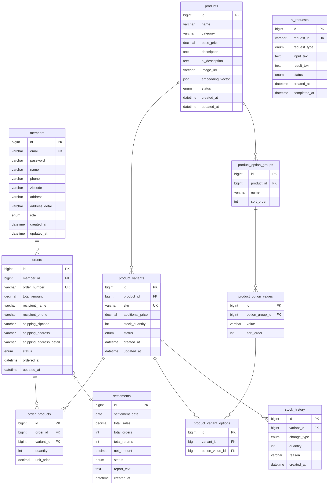

```mermaid
erDiagram
    members ||--o{ orders : " "
    orders ||--o{ order_products : " "
    product_variants ||--o{ order_products : " "
    products ||--o{ product_variants : " "
    products ||--o{ product_option_groups : " "
    product_option_groups ||--o{ product_option_values : " "
    product_variants ||--o{ product_variant_options : " "
    product_option_values ||--o{ product_variant_options : " "
    product_variants ||--o{ stock_history : " "
    orders }o--|| settlements : " "

    members {
        bigint id PK
        varchar email UK
        varchar password
        varchar name
        varchar phone
        varchar zipcode
        varchar address
        varchar address_detail
        enum role
        datetime created_at
        datetime updated_at
    }

    orders {
        bigint id PK
        bigint member_id FK
        varchar order_number UK
        decimal total_amount
        varchar recipient_name
        varchar recipient_phone
        varchar shipping_zipcode
        varchar shipping_address
        varchar shipping_address_detail
        enum status
        datetime ordered_at
        datetime updated_at
    }

    order_products {
        bigint id PK
        bigint order_id FK
        bigint variant_id FK
        int quantity
        decimal unit_price
    }

    products {
        bigint id PK
        varchar name
        varchar category
        decimal base_price
        text description
        text ai_description
        varchar image_url
        json embedding_vector
        enum status
        datetime created_at
        datetime updated_at
    }

    product_option_groups {
        bigint id PK
        bigint product_id FK
        varchar name
        int sort_order
    }

    product_option_values {
        bigint id PK
        bigint option_group_id FK
        varchar value
        int sort_order
    }

    product_variants {
        bigint id PK
        bigint product_id FK
        varchar sku UK
        decimal additional_price
        int stock_quantity
        enum status
        datetime created_at
        datetime updated_at
    }

    product_variant_options {
        bigint id PK
        bigint variant_id FK
        bigint option_value_id FK
    }

    stock_history {
        bigint id PK
        bigint variant_id FK
        enum change_type
        int quantity
        varchar reason
        datetime created_at
    }

    settlements {
        bigint id PK
        date settlement_date
        decimal total_sales
        int total_orders
        int total_returns
        decimal net_amount
        enum status
        text report_text
        datetime created_at
    }

    ai_requests {
        bigint id PK
        varchar request_id UK
        enum request_type
        text input_text
        text result_text
        enum status
        datetime created_at
        datetime completed_at
    }
```